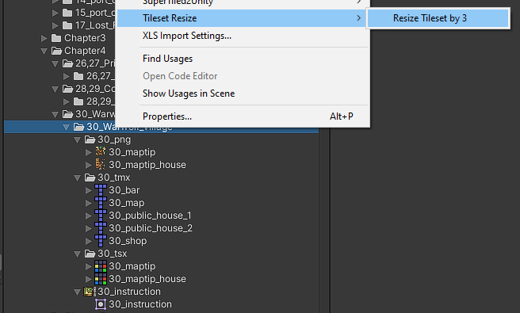
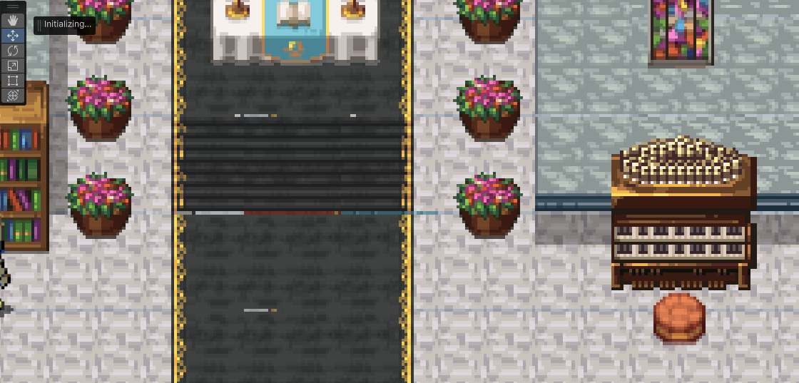
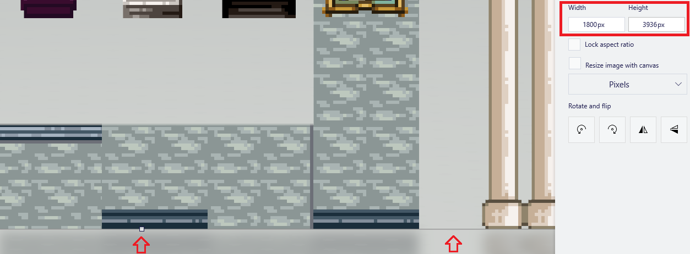
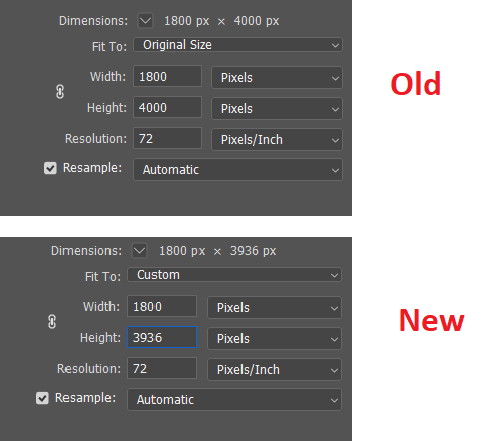

# Resize tileset in Unit to optimize

Right click on the root folder of the tileset asset you want to resize and select this option

This is the result, please smoke test after resize

Further optimize:

You can change the atlas size to fit with new size
For example the size is 704x992 now so you only need atlas with 1024x1024 size to contains all of it 

# Warning
#### Some tilemap after reducing by tool will get an error like this

### Reason and how to fix it
- There are some files that have a rate of 300% but there is an excess paragraph below

- So we need to crop the excess by cropping that part so that the height and the width are divisible by 3.
Example: (Height: 4000px to 3936px)

- After resizing the tilemap, we need to open the file TSX of the tilemap and edit with text editor to change the height and width same as the tilemap after resizing.

- After that, we need back to Unity for Unity to re-import the change of the tilemap (If we don't do that Unity can be error texture and we need to reset Unity) and reduce the tilemap by tools again

